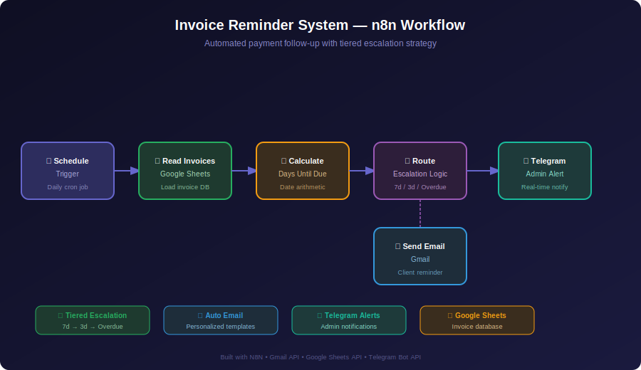

# 🧾 Invoice Reminder System

[](https://n8n.io/)
[](https://opensource.org/licenses/MIT)

A fully automated invoice management system that monitors payment deadlines, calculates due dates, and sends intelligent email reminders to clients. The system uses a tiered escalation strategy with real-time Telegram notifications for administrators.

## 🖼️ Workflow Preview



## 📋 Overview

This workflow automates invoice follow-up and payment reminders to eliminate manual tracking. It monitors a Google Sheets invoice database and automatically sends:

- **7-day reminder** - Friendly advance notice before due date
- **3-day urgent reminder** - Escalated follow-up with payment urgency
- **Overdue notice** - Final notice for past-due invoices
- **Telegram admin alerts** - Real-time notifications for all reminder actions

Perfect for freelancers, agencies, and small businesses that need professional, automated client payment follow-up.

## ✨ Features

- **Tiered Escalation Strategy** - Progressive reminders based on days until/past due date
- **Google Sheets Integration** - Reads invoice data and updates payment status automatically
- **Personalized Emails** - Client-specific HTML email templates with invoice details
- **Telegram Admin Notifications** - Real-time alerts when reminders are sent
- **Scheduled Automation** - Runs daily via cron trigger, fully hands-off
- **Smart Date Calculation** - Dynamically calculates days remaining based on current date

## 🛠️ Technology Stack

- **Platform**: n8n (v1.x+)
- **Triggers**: Schedule (Cron)
- **Integrations**: Gmail, Google Sheets, Telegram Bot API
- **Logic**: IF nodes with date arithmetic for escalation routing

## 📁 Project Structure

```
Invoice-Reminder-System/
├── Form to Multi-Channel Notifications.json  # n8n workflow export
├── README.md                                  # Documentation
├── SETUP.md                                   # Setup instructions
├── API.md                                     # API reference
├── CHANGELOG.md                               # Version history
└── CONTRIBUTING.md                            # Contribution guide
```

## 🚀 Quick Start

1. Import the `.json` workflow file into your n8n instance
2. Configure Gmail, Google Sheets, and Telegram credentials
3. Set up your invoice Google Sheet with columns: Client Name, Email, Invoice Amount, Due Date, Status
4. Activate the workflow - it will run daily and send reminders automatically

## 👤 Author

**Benbrika cherif salah** - n8n Automation Engineer
- GitHub: [@Benbrika8](https://github.com/Benbrika8)
- Upwork: [n8n Automation Expert](https://www.upwork.com/freelancers/~012969aad569596233)
- LinkedIn: [salah-benbrika-n8n](https://linkedin.com/in/salah-benbrika-n8n)

## 📄 License

MIT License - see [LICENSE](LICENSE) for details.
